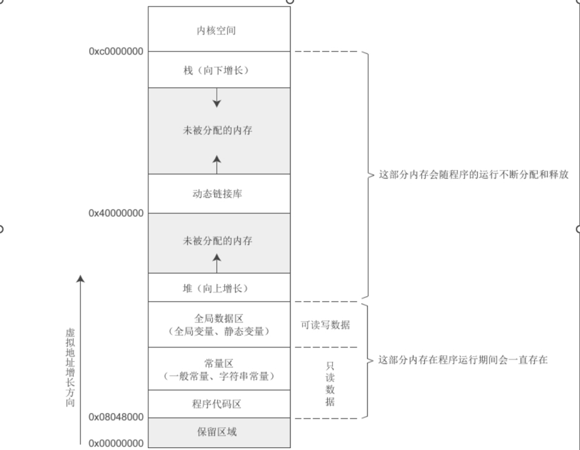
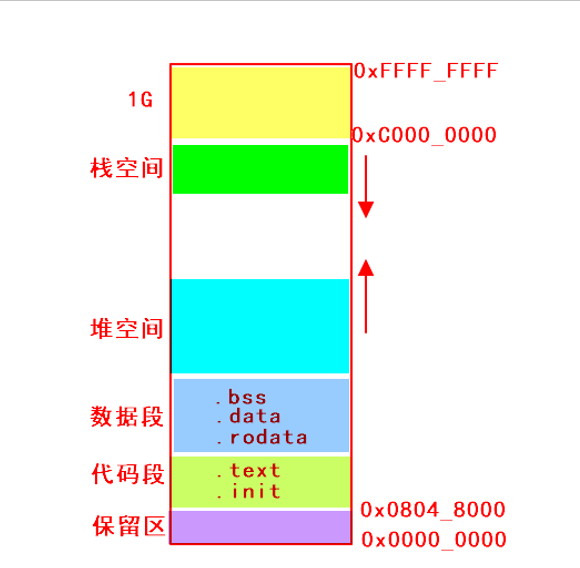
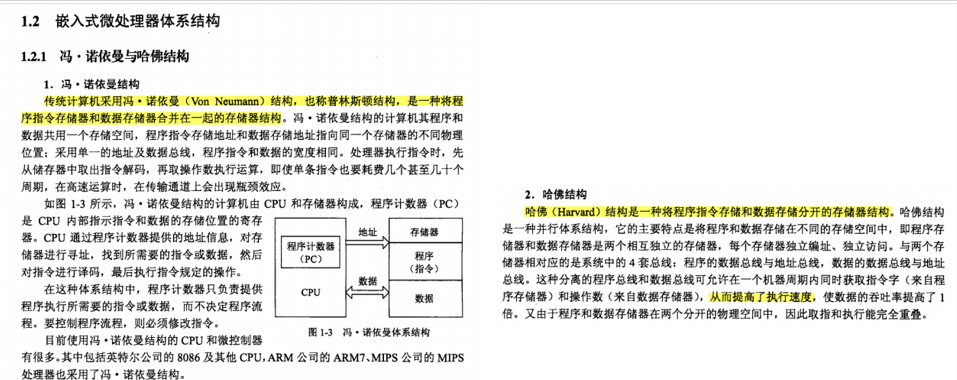
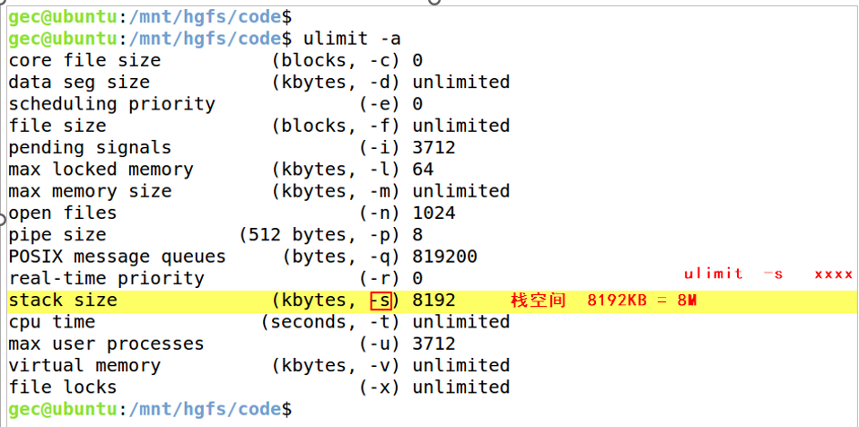

如果采用的是32bit的linux系统，则每个运行的程序都会得到4G大小的内存空间，只不过每个程序得到的4G大小的内存都是虚拟内存，而物理内存才只有4G，物理内存是真实存在的，而虚拟内存是通过映射得到的。

### (1)   保留区

保留区也可以称为不可访问区域，用户是**没有权限访问的**，对于Linux系统而言，保留区的地址范围是**0x0000_0000 ~ 0x0804_8000**，所以保留区的大小是128M，一般用户定义的指针变量在初始化的时候就可以指向这块空间，由于这块空间任何程序都没有权限访问，所以可以确保指针不会被误用，所以可以防止野指针出现，宏定义NULL其实就是指向0x0000_0000

### (2）代码段

程序由数据以及指令组成，代码段存储的是编译器对程序编译之后生成的二进制指令，代码段分为两部分，分别是.text段和.init段。

**.text段用于存储用户程序生成的指令**，**.init段用于存储系统初始化的指令**，这两部分的属性是**只读**的，在程序运行之后代码段中的数据就不应该再被修改。在程序运行之前代码段的内存空间就已经被内核计算完成。

### (3)   数据段

程序由数据以及指令组成，根据数据的生命周期和数据类型的不同，一般把数据存储在两部分，一个部分是栈空间，另一个部分是数据段。

数据根据数据类型（变量or常量，全局or局部）以及根据数据是否被初始化（已初始化or未初始化）把数据存储在三个不同的位置：.rodata段 .bss段 .data段。

.rodata段：被称为**只读常量区**，程序中的常量（整型常量、字符串常量）都是存储在该区域，对于该   区域的属性是只读的，当程序结束后该区域的内存会被释放。

.data段：用于存储程序中的已经被初始化的全局变量和已经被初始化的静态局部变量，另外注意初始化的值不能为0！

.bss段：用于存储程序中未被初始化的全局变量以及未被初始化的静态局部变量以及初始化为0的全局变量和初始化为0的静态局部变量。

### (4)   堆空间

堆空间属于用户可以随意支配的内存，用户想要支配堆空间的内存的前提是需要向内核申请，可以通过库函数malloc()、calloc()申请堆内存，注意堆空间需要用户手动申请以及手动进行释放，通过库函数free()释放堆内存。堆内存属于匿名内存，只能通过指针访问！！！

### (5)   栈空间

栈空间主要用于存储程序的命令行参数、局部变量、函数的参数值、函数的返回地址，当函数被调用期间，内核会分配对应大小的栈空间给函数使用，当函数调用完成则栈空间就会内核释放。

栈空间的内存存储是随机值，所以用户得到栈空间之后，应该把变量进行初始化，目的是防止变量中存储的值是不确定的。

对于栈空间的地址分配是**向下递增**，所以栈空间使用的越多，则分配的内存地址越低，栈空间的数据遵循“**先进后出**”原则，一般内核都会提供两个指针，一个指针指向栈顶，一个指针指向栈底，数据进入栈空间的动作就叫做入栈/压栈（PUSH），数据从栈空间出去的动作就叫做出栈/弹栈（POP）。

注意：Linux系统中栈空间的容量是有限的，如果超过容量，则会发生栈溢出，导致程序出现段错误。

