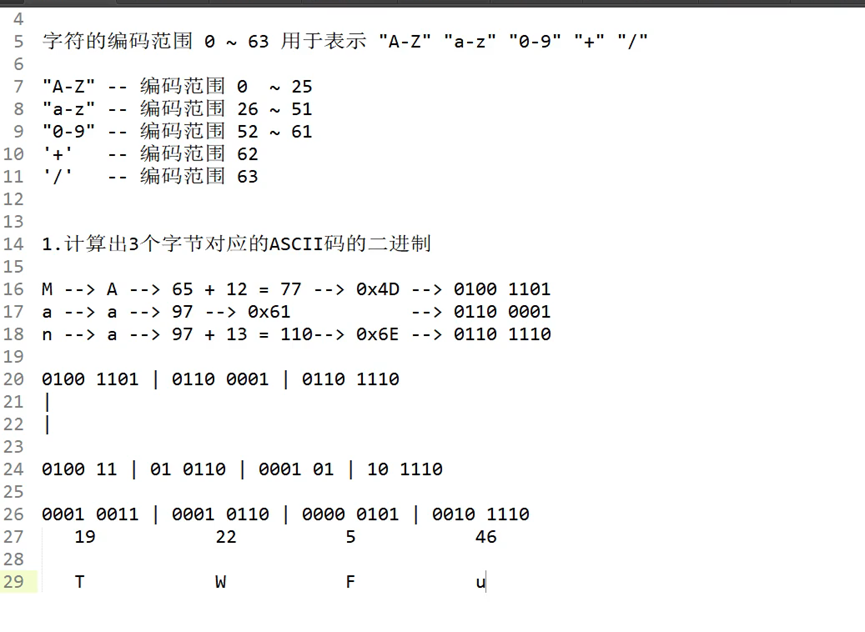
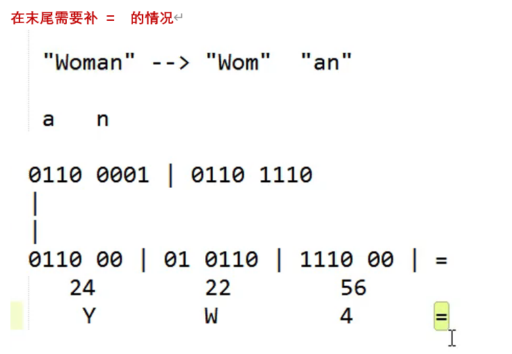

| 原始数据长度 % 3 | 说明        | 编码后补几个 `=` |
| ---------------- | ----------- | ---------------- |
| 0                | 刚好被3整除 | 不补             |
| 1                | 还差2字节   | 补2个 `==`       |
| 2                | 还差1字节   | 补1个 `=`        |


**Base64 非常常用于 JSON 格式中传输二进制数据**，因为 JSON 本身只能表示文本，**不支持原始的二进制数据（如图片、音频、加密数据）**，这时就可以通过 Base64 编码将二进制数据转成安全的字符串嵌入 JSON 中。

------

示例：Base64 嵌入图片内容的 JSON

```json
json复制编辑{
  "filename": "cat.jpg",
  "data": "/9j/4AAQSkZJRgABAQAAAQABAAD...=="   // 图片的 Base64 编码内容
}
```

这里的 `data` 字段是原始二进制 JPEG 文件的 Base64 编码内容，便于通过网络、HTTP、WebSocket、API 等传输。