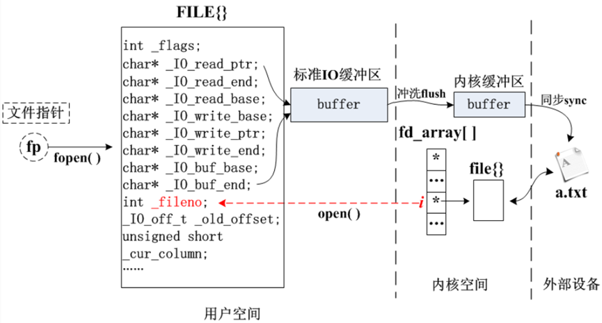
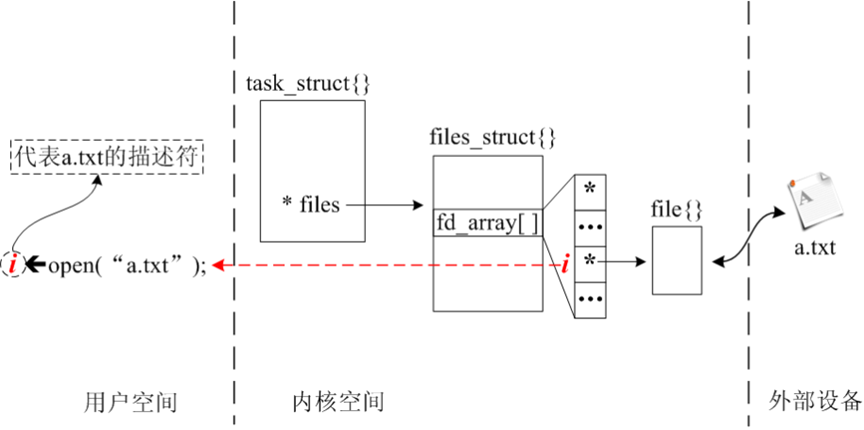

标准io和系统io明显的区别：1.标准io有缓冲区，系统io没有
			  2.标准io用链表管理文件，返回文件指针，理想状态下是第四个节点
								（前三个：标准输入，标准输出，标准出错）
			    系统io用顺序表管理文件，返回文件下标，理想状态是3  （0，1，2，3）
								 （前三个：标准输入，标准输出，标准出错）
标准io二次封装过，可移植性好，不过于依赖硬件资源

------

标准 I/O（stdio）是基于系统 I/O 封装的一套高级接口，它使用了用户态缓冲区来提高读写效率，减少系统调用次数。

工作流程简要如下：

1. 标准 I/O（如 fread()、fgets()）内部会调用系统 I/O 接口（如 read()）从文件中读取数据。
2. 读取的数据会先进入内核空间的缓存（比如页缓存）。
3. 然后系统 I/O 将数据拷贝到     标准 I/O 的用户空间缓冲区（比如 FILE\* 对应的缓冲区）。
4. 最终用户程序再从用户缓冲区读取数据。

------

FILE \*fp = fopen("data.txt", "r");

char ch = fgetc(fp);

你可能以为这个 fgetc() 是每次都从磁盘中读一个字节，其实：

第一次调用 fgetc() 时，它会通过 read() 读入 一整个块（如4KB） 到 stdio 的缓冲区。

后续的 fgetc() 都直接从用户缓冲区中取，不再调用系统 I/O，直到缓冲区用完。