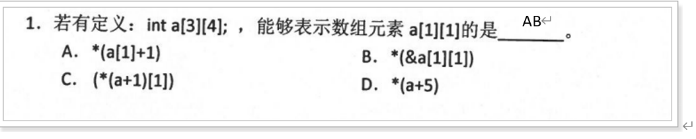
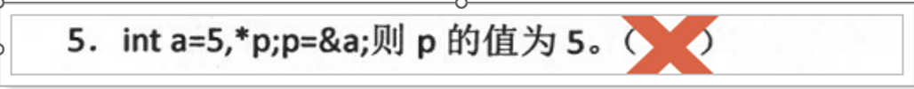
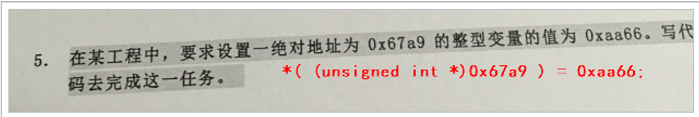
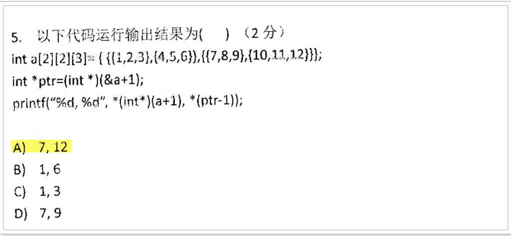
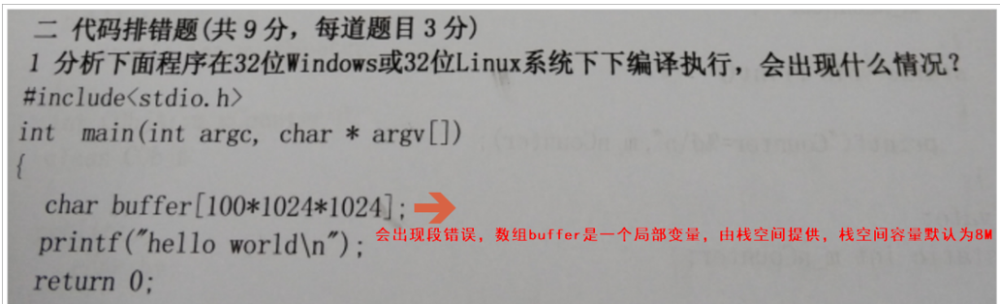
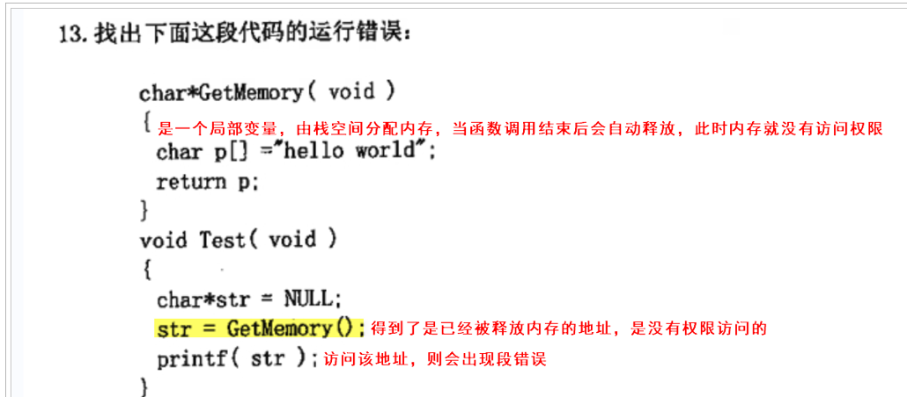
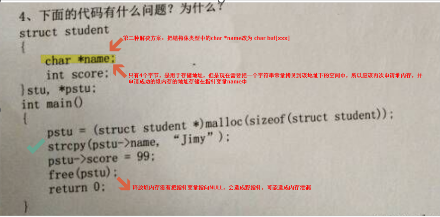

在C/C++中，`int *p = data` 和 `int *p = &data` 有本质区别，具体取决于 `data` 的类型：

### 1. 如果 `data` 是数组名（例如 `int data[10]`）：

- **`int *p = data`**  
  数组名 `data` 在大多数情况下会退化为指向数组首元素的指针（即 `&data[0]`）。  
  这是合法的，`p` 会指向数组的第一个元素。

- **`int *p = &data`**  
  `&data` 获取的是整个数组的地址（类型为 `int(*)[10]`），而 `p` 是 `int*` 类型，类型不匹配，编译器会报错。  
  正确写法需强制类型转换：`int *p = (int*)&data`。

### 2. 如果 `data` 是单个 `int` 变量（例如 `int data`）：

- **`int *p = data`**  
  这是非法的，因为 `data` 是整数值，而 `p` 需要的是地址。编译器会报类型不匹配的错误。

- **`int *p = &data`**  
  这是正确的，`&data` 获取变量 `data` 的地址，赋值给指针 `p`。

### 3. 如果 `data` 是指针（例如 `int *data`）：

- **`int *p = data`**  
  合法，`p` 和 `data` 指向同一地址。

- **`int *p = &data`**  
  非法，`&data` 是指针的地址（类型为 `int**`），而 `p` 是 `int*`，类型不匹配。

### 总结：
| 表达式           | `data` 是数组      | `data` 是 `int` 变量 | `data` 是 `int*`     |
| ---------------- | ------------------ | -------------------- | -------------------- |
| `int *p = data`  | 合法（指向首元素） | 非法（类型不匹配）   | 合法（指向同一地址） |
| `int *p = &data` | 非法（需类型转换） | 合法（取变量地址）   | 非法（类型不匹配）   |

关键点在于理解 `data` 的类型和它何时会退化为指针。

### 练习：

