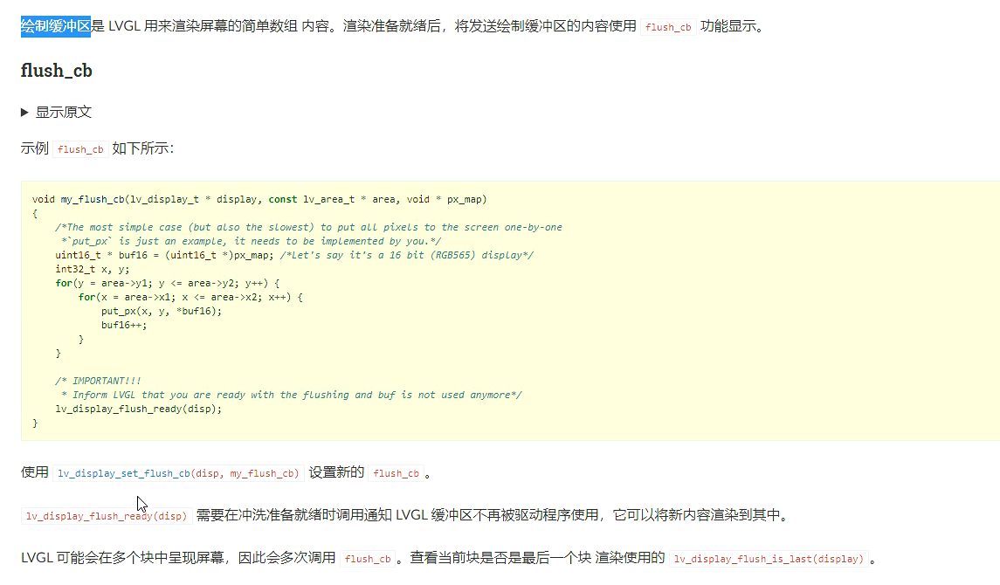

## 时间换空间

1.取消字节对齐

2.用一个循环，循环里面每次获取A的一个字符并写入到文件B中

3.在使用LVGL图形库的时候，采用局部渲染的方式少量多次来进行显示，节约内存空间

------

## 空间换时间

1.结构体、联合体字节对齐

2.循环队列牺牲一块空间，判断满队

3.标准io有输入、输出缓冲区，减少使用read和write调用的次数。

4.BMP图片一行大小为4的倍数

5.在使用LVGL图形库时，采用多缓冲来提高图形的刷新效率

6.SPOOLing技术（假脱机技术）
