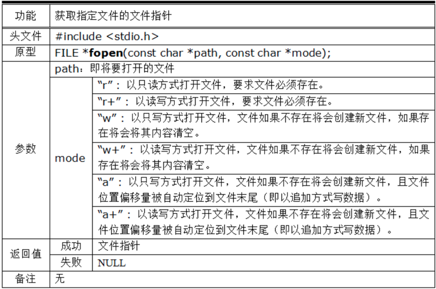
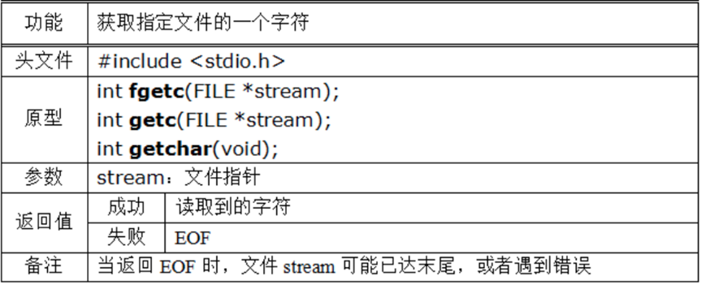
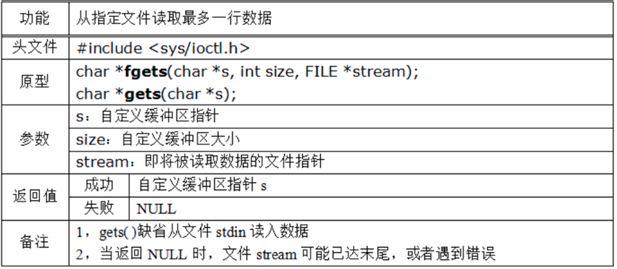
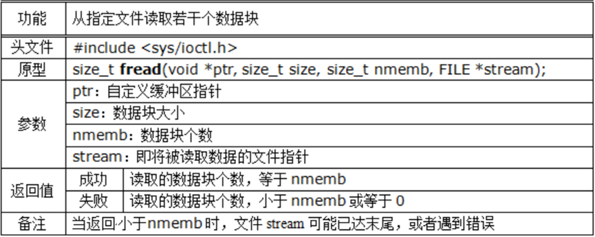
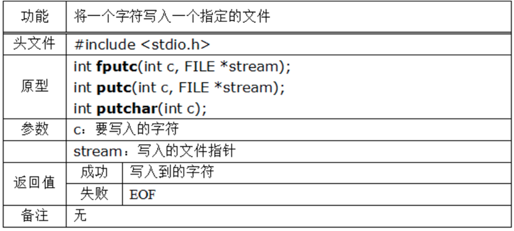
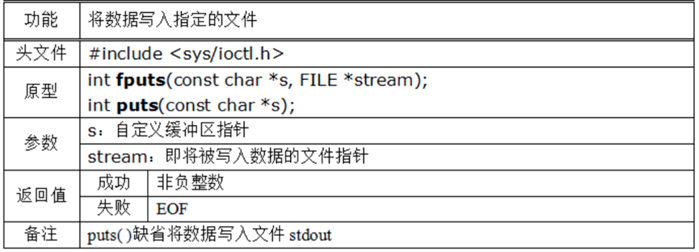
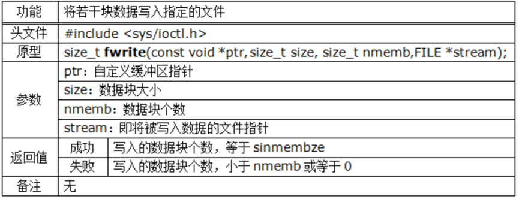
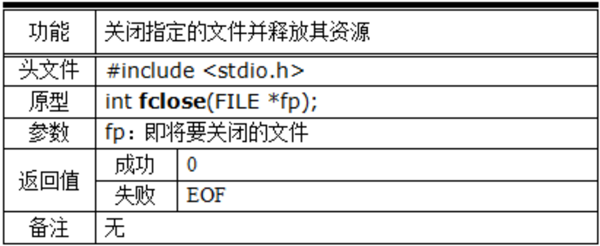
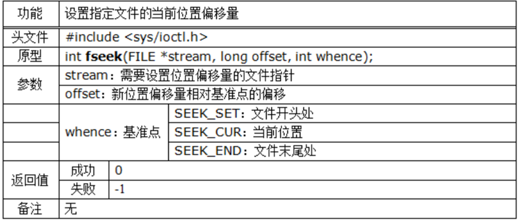
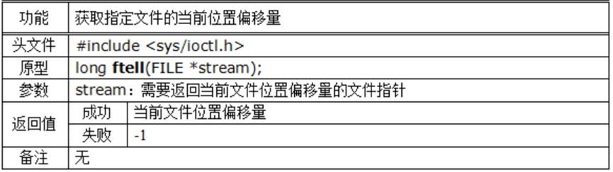

## 1.fopen( )



```c
FILE *src_fp = fopen(argv[1],"rb");
```

------

## 2.读取

### （1）字符读取



```c
int ch=fgetc(file);//注意返回类型
while(ch !=EOF)
{
    printf("%c",ch);
    ch=fgetc(file);
}
```

### （2）按行读取



读取到换行符\n时会结束

### （3）按块读取



```c
//6.循环写入目标文件
while(loop_cnt--)
{
    //读取
    fread(data_buffer,BUFFERSIZE,1,src_fp);
    //写入
    fwrite(data_buffer,BUFFERSIZE,1,dest_fp);
}
```

## 3.写入

### （1）字符写入



### （2）按行写入



### （3）按块写入



## 4.fclose( )



## 5.位移

### （1）设置位移



### （2）获取位移



```c
//4.偏移光标到尾为了计算大小，再偏移光标到头
fseek(src_fp,0,SEEK_SET);
int src_size=ftell(src_fp);
fseek(src_fp,0,SEEK_SET);
```

## 6.fprintf( )

```c
FILE *fp=fopen("xxx.txt","rb");
int a=1;
fprintf(fp,"a=%d",a);//到文件
fclose(fp);
```

## 7.sprintf( )

```c
char buf[128]={0};
int b=2;
sprintf(buf,"b=%d",b);//向缓冲区中输出格式化字符串
printf("%s\n", buf); //输出b=2,自动加入'\0'
```

