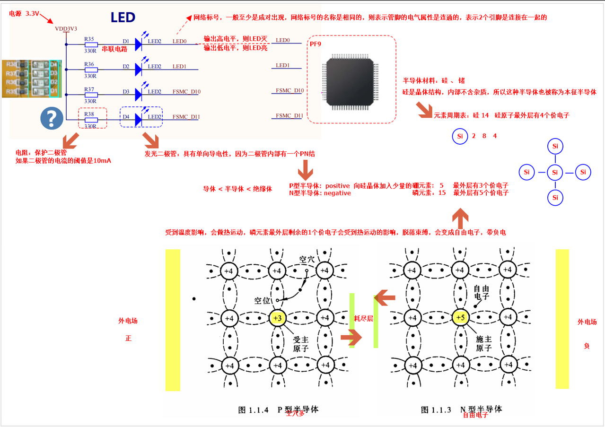
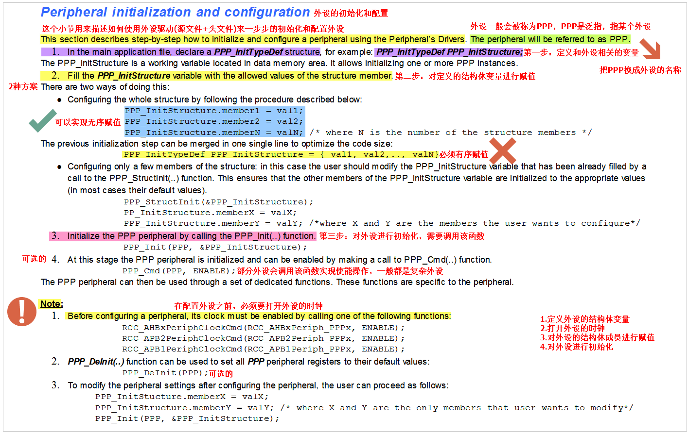
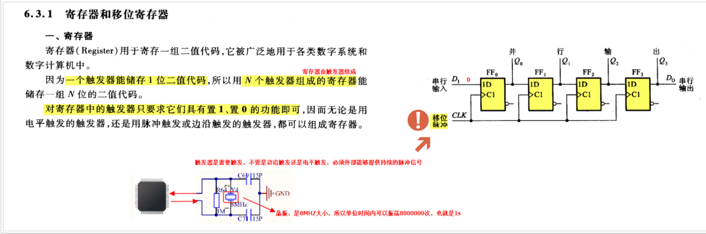
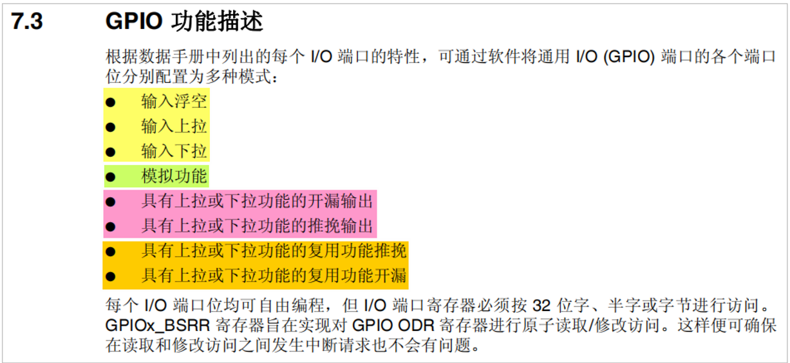
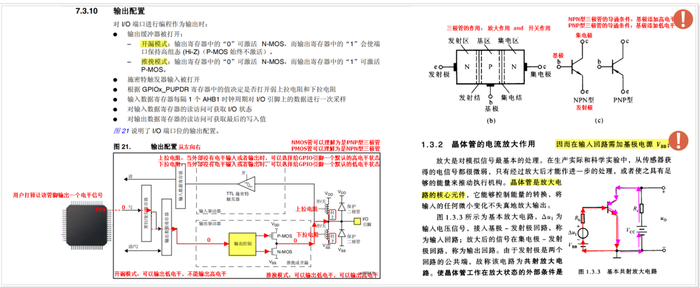
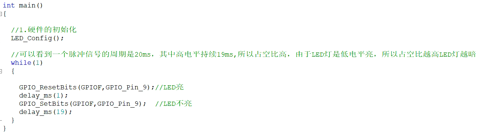

## 1.发光二极管工作原理

PN 结是指将P型半导体和N型半导体连接在一起后，在它们的交界面处形成的一个结区，是半导体器件（如二极管、三极管、MOS管等）的基本结构单元。二极管：只允许电流从 P → N 单向流动，LED 发光二极管：在正向导通时发光。

 ***正向偏置原理图（导通）：***				

  电源+      P区 → N区      电源-
     |           	|                  |
   ↑↑↑            耗尽区          ↓↓↓
（空穴）   电场被抵消  （电子）
→载流子自由运动，形成电流→

***反向偏置原理图（截止）：***

  电源-    P区 ← N区    电源+
     |         	|                |
   ↑↑↑          耗尽区         ↓↓↓
（空穴）←←耗尽区更宽←←（电子）
→电场加强，载流子被阻止，不导电

***零偏置：***

不导通，也不截止。

## 2.外设初始化流程

## 3.寄存器、触发器

时钟相当于外设的开关，不打开时钟，则晶振产生的振荡信号就无法输入到MCU内部的外设中，则没有时钟信号，触发器无法触发，则触发器无法锁存数据，而寄存器是由N个触发器组成，所以寄存器就无法工作，而控制硬件，必须通过寄存器实现。

时钟信号：周期性的脉冲，要不断的提供给触发器，触发器才能触发，寄存器才能锁存（一个bit）

## 3.GPIO（通用输入输出口）

TTL电平协议：>2.4V就表示高电平，<0.4V就表示低电平。

| **工作区** | **BE 结偏置** | **BC 结偏置** | **C-E导通？** | **用途**                       | **状态说明**           |
| ---------- | ------------- | ------------- | ------------- | ------------------------------ | ---------------------- |
| **截止区** | 反向偏置      | 反向偏置      | ❌ 不导通      | 开关“断”                       | 三极管关断，无电流     |
| **放大区** | 正向偏置      | 反向偏置      | ✅ 部分导通    | 模拟放大，音频放大、射频放大等 | 有控制、线性放大       |
| **饱和区** | 正向偏置      | 正向偏置      | ✅ 完全导通    | 开关“通”                       | 三极管导通，大电流流动 |

**BE 结**：Base–Emitter（基极–发射极）之间的 PN 结

**BC 结**：Base–Collector（基极–集电极）之间的 PN 结

**偏置类型**：

- **正向偏置**：P 接高电平，N 接低电平，导通
- **反向偏置**：P 接低电平，N 接高电平，截止

## 4.调节脉冲宽度（延时方式，调节高低电平比例）

