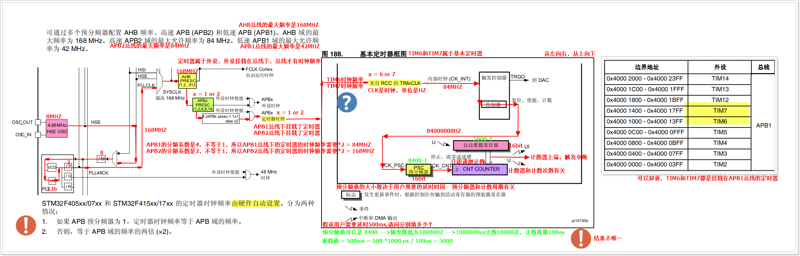

MCU提供5种时钟源，分别是HSI、HSE、LSI、LSE、PLL，每种时钟源的频率都是不同的。

------

Systick定时器有2个时钟源，一个是内部时钟（FCLK）（168MHz），一个是外部时钟（STCLK）（168MHZ/8 = 21MHZ）。

如果选择使用内部时钟（168MHZ）作为系统嘀嗒定时器的时钟源，则嘀嗒定时器的计数周期：1000000us生成168000000个脉冲，意味着 1us可以生成168个脉冲，所以计数周期等于1/168us。

------

对于STM32F407微处理器而言，内部一共集成了14个定时器，其中有2个基本定时器（TIM6和TIM7）、10个通用定时器（TIM2~TIM5, TIM9~TIM14）、2个高级定时器（TIM1和TIM8）。

其中通用定时器TIM2和TIM5为32位定时器，其他为16位定时器，当然，定时器位数越大，定时时间越久。



------

“定时器通道”一般是指 MCU **通用定时器 / 高级定时器**（比如 STM32 的 TIM1、TIM2…）中的 **Capture/Compare Channel**（捕获/比较通道，简称 CC 通道）。

我帮你从概念到应用整理一下：

------

## 1. **定时器和通道的关系**

- 一个定时器是一个“时间基准”模块，它内部有一个计数器（CNT）。

- **通道**（Channel）是定时器的输出或输入接口，每个通道都有独立的比较寄存器（CCR）。

- 通道通常命名为：

  ```
  CH1、CH2、CH3、CH4
  ```

  比如：

  - TIM1 有 4 个通道
  - TIM3 有 4 个通道
  - TIM9 只有 2 个通道（CH1、CH2）

------

## 2. **通道的主要模式**

每个通道都可以单独配置工作模式，互不干扰。常见模式：

| 模式                           | 功能说明                                                    | 典型应用             |
| ------------------------------ | ----------------------------------------------------------- | -------------------- |
| **输出比较（OC）模式**         | 当 CNT == CCRx 时产生事件（可输出引脚电平翻转、置高、置低） | PWM 波形、定时触发   |
| **PWM 模式**                   | 占空比由 CCRx 控制，周期由 ARR 控制                         | 电机控制、亮度调节   |
| **输入捕获（IC）模式**         | 在输入引脚检测到指定边沿时，将当前 CNT 值锁存到 CCRx        | 测频率、测脉宽       |
| **单脉冲模式（One Pulse）**    | 接收到触发后输出一次设定宽度的脉冲                          | 超声波测距触发       |
| **互补输出模式**（高级定时器） | 通道输出主波形，互补通道输出反相波形                        | 三相电机驱动、逆变器 |

------

## 3. **通道与引脚的关系**

- 每个通道可以映射到一个或多个 GPIO 引脚（通过 AF 复用功能）。
- 例如 STM32F4 系列：
  - TIM3_CH1 可能映射到 **PA6** 或 **PB4**
  - TIM3_CH2 可能映射到 **PA7** 或 **PB5**

映射是固定的，要参考芯片的 **引脚复用表**。

------

## 4. **一个通道的寄存器组成**

以 TIMx_CH1 为例：

- **CCMR1**（Capture/Compare Mode Register）：配置通道模式（PWM、输入捕获等）。
- **CCER**（Capture/Compare Enable Register）：控制通道是否使能、输出极性。
- **CCR1**（Capture/Compare Register 1）：存储比较值（用于 PWM 占空比或捕获值）。

------

## 5. **例子：PWM 输出**

假设我们用 **TIM3_CH1** 输出 1 kHz、50% 占空比的 PWM：

1. 配置时钟，使 TIM3 计数频率为 1 MHz（周期 1 µs）。
2. 设 ARR = 1000 - 1（周期 1000 µs = 1 kHz）。
3. 设 CCR1 = 500（高电平 500 µs → 占空比 50%）。
4. 配置 CCMR1 为 PWM 模式 1。
5. 使能 CC1E（通道 1 输出使能）。
6. 配置 CH1 对应的 GPIO 为复用输出模式。

------

## 6. **例子：输入捕获**

如果我们想测量外部信号的频率：

1. 配置 CH1 为输入捕获模式，触发边沿为上升沿。
2. 当检测到上升沿时，将 CNT 值存到 CCR1。
3. 两次捕获的差值就是信号周期。