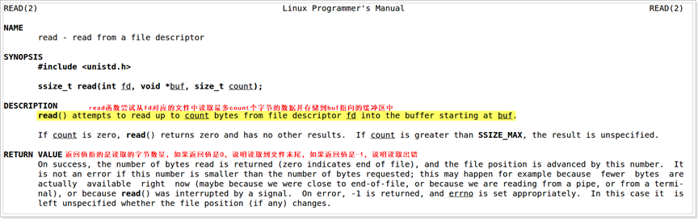
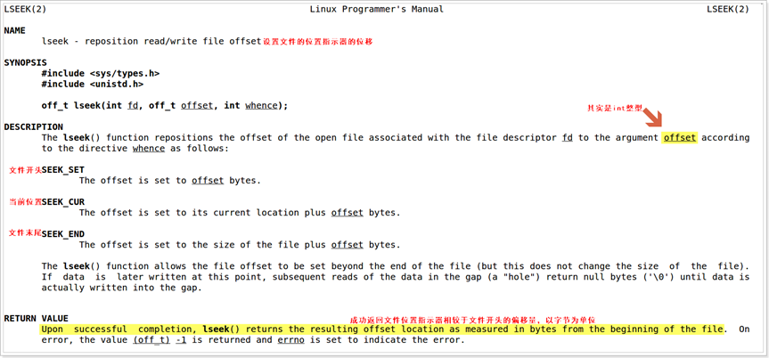
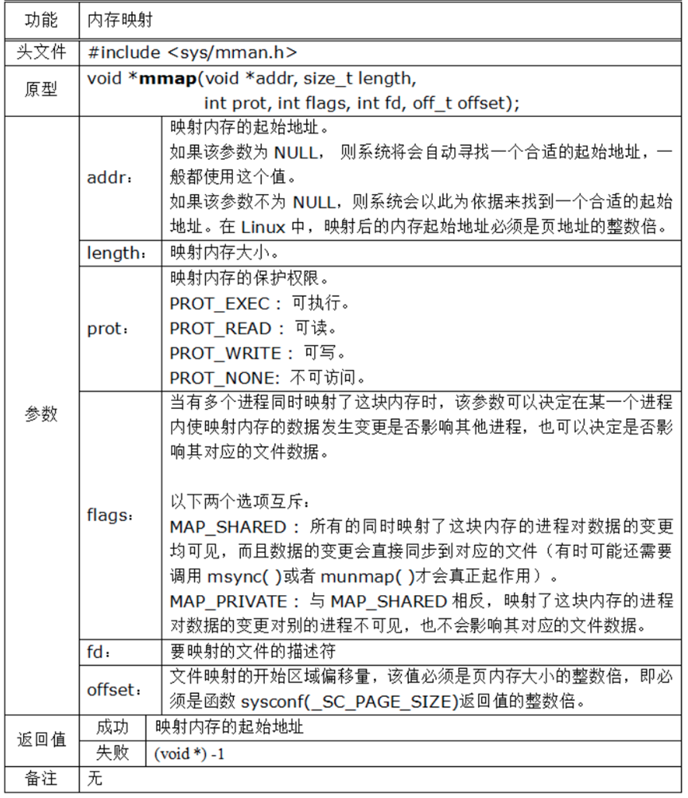

## 1.open( )

```c
int lcd_fl=open("dev/fd0",O_RDWR);
```

## 2.close( )

```c
close(lcd_fl);
```

## 3.read( )



## 4.write( )

```c
write(lcd_fd,colorbuff,800*480*4);
```

## 5.lseek( )



## 6.ioctl( )

```c
#include <liunx/fb.h> //必须包含
int lcd_fl=open("dev/fd0",O_RDWR);

struct fb_fix_screeninfo lcd_finfo;//主要用于获取FrameBuffer的固定参数
struct fb_var_screeninfo lcd_vinfo;//主要用于获取和设置FrameBuffer的可变（虚拟）屏幕参数

//请求信息去看:/usr/include/linux/fb.h
ioctl(lcd_fl,FBIOGET_VSCREENINFO,&lcd_vinfo);
```

## 7.mmap( )



```c
int lcd_fd = open("/dev/fb0",O_RDWR);

//2.对LCD进行内存映射  mmap函数 记得接收返回值
int *lcd_mp = (int *)mmap(
                            NULL,
                            800*480*4,
                            PROT_READ|PROT_WRITE,
                            MAP_SHARED,
                            lcd_fd,
                            0
                         );

//3.把颜色分量写入到申请的映射内存空间中，通过地址偏移实现访问
for (int i = 0;i < 800*480; ++i)
{
    lcd_mp[i] = 0x00FF0000;
}

//4.关闭LCD并解除内存映射
munmap(lcd_mp,800*480*4);
close(lcd_fd);
```

